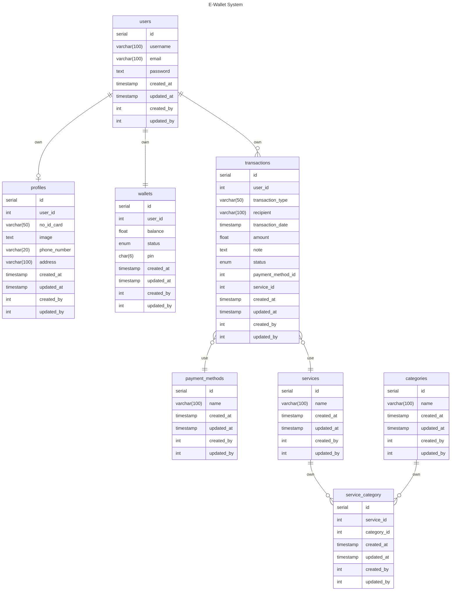

# ERD E-Wallet System

```mermaid
---
    title: E-Wallet System
---
erDiagram
    users{
        serial id
        varchar(100) username
        varchar(100) email
        text password
        timestamp created_at
        timestamp updated_at
        int created_by
        int updated_by
    }

    profiles{
        serial id
        int user_id
        varchar(50) no_id_card
        text image
        varchar(20) phone_number
        varchar(100) address
        timestamp created_at
        timestamp updated_at
        int created_by
        int updated_by
    }

    wallets{
        serial id
        int user_id
        float balance
        enum status
        char(6) pin
        timestamp created_at
        timestamp updated_at
        int created_by
        int updated_by
    }

    transactions{
        serial id
        int user_id
        varchar(50) transaction_type
        varchar(100) recipient
        timestamp transaction_date
        float amount
        text note
        enum status
        int payment_method_id
        int service_id
        timestamp created_at
        timestamp updated_at
        int created_by
        int updated_by
    }

    payment_methods{
        serial id
        varchar(100) name
        timestamp created_at
        timestamp updated_at
        int created_by
        int updated_by
    }

    services{
        serial id
        varchar(100) name
        timestamp created_at
        timestamp updated_at
        int created_by
        int updated_by
    }

    categories{
        serial id
        varchar(100) name
        timestamp created_at
        timestamp updated_at
        int created_by
        int updated_by
    }

    service_category{
        serial id
        int service_id
        int category_id
        timestamp created_at
        timestamp updated_at
        int created_by
        int updated_by
    }

    users ||--o| profiles : own
    users ||--o{ transactions : own
    users ||--|| wallets : own
    transactions }o--|| payment_methods : use
    transactions }o--|| services: use
    services ||--o{ service_category : own
    categories ||--o{ service_category : own

```
