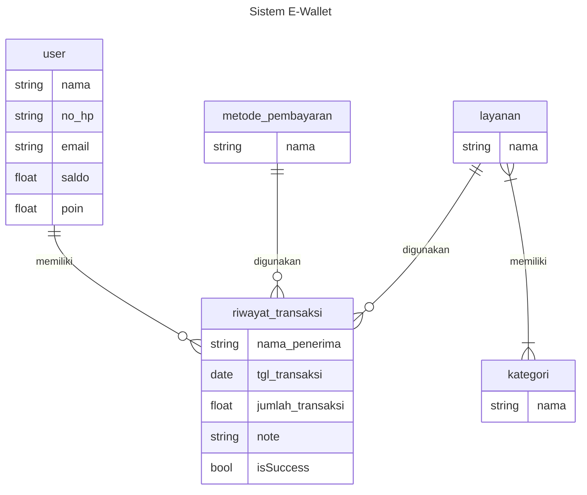

# ERD Sistem E-Wallet

```mermaid
---
    title: Sistem E-Wallet
---
erDiagram
    user{
        string nama
        string no_hp
        string email
        float saldo
        float poin
    }

    riwayat_transaksi{
        string nama_penerima
        date tgl_transaksi
        float jumlah_transaksi
        string note
        bool isSuccess
    }

    metode_pembayaran{
        string nama
    }

    layanan{
        string nama
    }

    kategori{
        string nama
    }

    user ||--o{ riwayat_transaksi : memiliki
    metode_pembayaran ||--o{ riwayat_transaksi : digunakan
    layanan }|--|{ kategori : memiliki
    layanan ||--o{ riwayat_transaksi : digunakan

```
