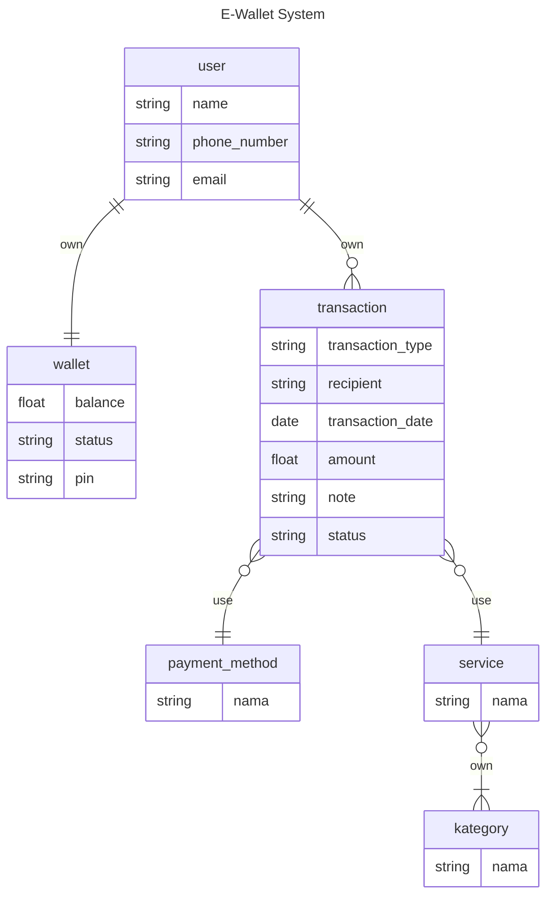

# ERD E-Wallet System

```mermaid
---
    title: E-Wallet System
---
erDiagram
    user{
        string name
        string phone_number
        string email
    }

    wallet{
        float balance
        string status
        string pin
    }

    transaction{
        string transaction_type
        string recipient
        date transaction_date
        float amount
        string note
        string status
    }

    payment_method{
        string nama
    }

    service{
        string nama
    }

    kategory{
        string nama
    }

    user ||--o{ transaction : own
    user ||--|| wallet : own
    transaction }o--|| payment_method: use
    transaction }o--|| service: use
    service }o--|{ kategory : own

```
